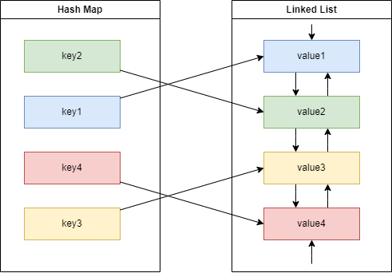

= LRU Cache Storage (Coding Task)
:reproducible:
:toc:
//:toclevels: 3
:icons: font
//:sectnums:

== Problem Analysis

The task is to build a capacity-bound in-memory cache with LRU eviction policy and strict `O(1)` `get` and `put` operations complexity.

The base structure with `O(1)` complexity is a hash-map, it is kind of obvious.

The trick is to track keys' priorities without sacrificing the complexity.

A naive approach would be to add a monotonic counter and track each key's priority by storing an incremented counter value in the main hashmap payload. However, it'll require an `O(n)` for each `put` once the capacity limit is reached.

To resolve that, we have to store the order of keys access history in another structure that can add data with `O(1)` complexity. A FIFO queue would be a fit unless we didn't need to remove elements from the middle of the queue and put them in its end. A double-linked list structure is the one that has all the required properties - `O(1)` insertion to both ends and `O(1)` removal from the middle.

So, the solution is to use a hash-map and create a double-linked list from its elements at the same time.

.Solution Diagram

=== Complexity Analysis

The requirement is to have exactly `O(1)` complexity both for `get` and `put` operations. As in all hash-maps, the proposed solution has an average `O(1)` and a worst-case `O(n)` complexity both for `get` and `put`.

Additional linked-list operations have `O(1)` complexity, so the resulting average complexity stays `O(1)`.

{empty}

.Memory complexity:
* Hash-map - `O(n)`
* Linked-list - `O(n)`
* Resulting - `O(n)`

== Solution Structure

.The solution has the following structure:
* `Oktopost.Storage` folder contains the solution itself.
* `Oktopost.Storage.Tests` folder contains unit tests.
+
NOTE: There is an error in the provided initially `test_put_NoStorageSpaceLeft_ItemUntouchedForTheMostTimeIsRemoved` test: it should be `assertNotNull` for `a` and `assertNull` for `b`, not vice versa. It is unclear if this is a part of the challenge or just a mistake. If it is a mistake I suggest fixing it for future candidates.
* `Oktopost.Storage.Benchmarks` folder contains benchmarks.

== Implementations

=== ThreadLocalStore

`ThreadLocalStore` is a non-thread-safe `IStore` implementation.

{empty}

.Potential usage scenarios:
* A single-threaded memory-limited data processing could use this kind of LRU cache.
* A thread-local cache.
* A cache used in long-running async-await operation (async-local cache).

{empty}

.What could be done better:
. Reduce allocations (`struct`, `ref struct`). The code will be ugly, and we would want to carry it to production and support it unless it gives us tangible benefits.
. Add support for generics, custom comparer, and other stuff expected from library-grade solutions.
. `CollectionsMarshal` can help reduce hash-map lookups with a trade-off of stepping onto `unsafe` territory. We would only want to step onto that territory if it benefits us.

=== ThreadLocalStoreV2

`ThreadLocalStoreV2` is the same solution as the `ThreadLocalStore`, but it uses a library-provided `LinkedList` implementation; therefore, it's easier to read.

=== ConcurrentStore

`ConcurrentStore` is an attempt to provide a thread-safe solution. I ended up with a simple lock-guarding wrapper. Given a high load, this solution will lead to lock contention, and it might be better to consider other eviction policies or use thread-local ones to improve the throughput.

The reason why we can't do a decent thread-safe lock-free solution is that we need to modify the `LinkedList` for each operation, even for the `get` deeming useless any lock-free attempts.

== Benchmarks

.Methodology:
* Store capacity - `10 000`
* Test data size - `500 000`
* Unboud tests - write `10 000` values (up to capacity), then read `500 000` keys
* Bound tests - write `500 000` values (over capacity), then read `500 000` keys
* Reference tests - `Dictionary`, `ConcurrentDictionary` - using pure library hash-maps (capacity limit doesn't actually work)

.Benchmark Results
[source,markdown]
----
| Method                      | Mean      | Allocated    |
|---------------------------- |----------:|-------------:|
| UnboundDictionary           |  12.74 ms |    276.44 KB |
| Unbound                     |  12.96 ms |    745.23 KB |
| UnboundV2                   |  13.23 ms |    823.39 KB |
| UnboundConcurrentDictionary |  12.66 ms |   2653.35 KB |
| UnboundConcurrent           |  16.87 ms |    823.41 KB |
| BoundDictionary             |  58.66 ms |  42378.02 KB |
| Bound                       |  49.05 ms |    745.26 KB |
| BoundV2                     |  52.65 ms |    823.42 KB |
| BoundConcurrentDictionary   | 462.29 ms | 144140.14 KB |
| BoundConcurrent             |  59.20 ms |    823.45 KB |
----

.Conclusion:
* Negligible complexity overhead.
* 3x memory overhead in comparison with a pure hash-map.
* `ConcurrentStore` lock overhead is in acceptable range for single-threaded tests without lock contention. This implementation might be a better candidate to use "by default" than the thread-local ones.