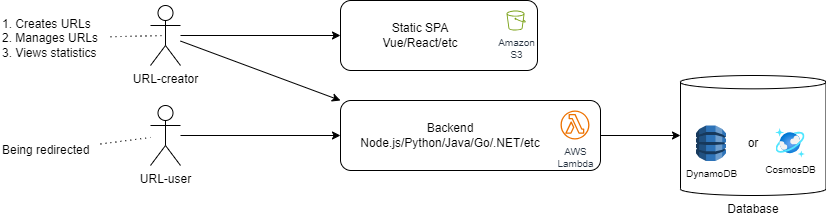
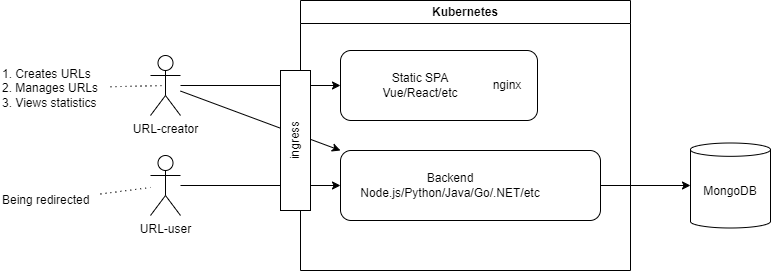

= URL Shortener (Project Planning Task)
:reproducible:
:toc:
:icons: font

== Project Scope and Limitations

. We want to launch an MVP as soon as possible.
. Since the project is at the idea-evaluation stage, we want to spend as minimum resources as possible. This includes both an initial R&D capital investment and operational costs for the infrastructure and ongoing support. I.e. minimize the TCO.
. Uncertainty:
.. Do we want to collect any telemetry and sell it afterward?
.. Do we want to add ad-monetization to the service? Maybe a paid option to create an ad-free links for the URL-creators?
.. Are there any government regulations we need to meet?
.. For the purpose of the further planing it is assumed that all of those points are unclear and should not be brought into the scope of MVP.
. We don't need a session or account support, meaning there will be no way to see all the URLs you've shortened so far and manage them. It is enough if the URL-creator will be able to access his URL-management page right after shortening or later if they save/bookmark that management page.

== High-Level Design

.Suitable for idea-evaluation with MVP phase 
=== Serverless

{empty}

.Serverless Architecture Diagram

{empty}

.Pros:
. Negligible setup costs.
. Negligible constant costs.
. Negligible maintenance burden.
. Out of the box scalability, availability, logging, monitoring, and other perks.

{empty}

.Cons:
. Possible vendor lock-in if don't take precaution separating our infrastructure access layer with decent abstractions.
. Less attractive costs per click at high load compared to a dense compute resources.

{empty}

.Suitable for large scale phase or if the company already has some infrastructure and it is available to allocate some capacity out of it.
== Cloud-Native

{empty}

.Cloud-Native Architecture Diagram

{empty}

.Pros:
. Vendor independence (Amazon/Azure/GCP/On-prem/etc.)
. Lower costs per click at high volumes.
. Fine-grained control over the solution.

{empty}

.Cons:
. Higher constant costs.
. High initial setup costs.
. Ongoing maintenance burden.
. Scalability, availability, logging, monitoring, and other perks are up to our choice of configuration leading to a corresponding time, resources and attention investment.

=== Key Technical Decisions

{empty}

. We'll store the management token inside the URL.
. We'll store the statistics counter inside the URL database entry.
. We'll update the counter using optimistic compare-and-swap algorithm which should be suitable for the 1000 clicks per day load given in the requirements.

== Required Resources

{empty}

.People:
. 1 DevOps
. 1-2 Full-stack engineers *or*
.. 1 Back-end engineer
.. 1 Front-end engineer
. 1 QA

{empty}

.Resources:
. Git-Hub Subscription
. AWS Subscription

== Technologies

The product is pretty simple and can be implemented using any modern front-end and back-end frameworks.

Given that we want to launch as soon as possible, the most rational choice is to stick to the technologies the team has experience in.

{empty}

.For Oktopost I believe it is the following:
. Front-end: `Vue.js`
. Back-end: `PHP` (+ some framework like `Laravel` or whatever the team is familiar with)
. Database: `MongoDB` (`CosmosDB` with `MongoDB` protocol for serverless)
. Infrastructure:
* Serverless option:
.. Amazon S3
.. Amazon API Gateway
.. AWS Lambda
.. CosmosDB
* Cloud-native option:
.. Amazon EKS
.. MongoDB

== Security Considerations

The only identified risk is an API abuse causing high cloud charges.

To mitigate this risk we'll configure a rate limit at the Amazon API Gateway level.

== Tasks Breakdown

{empty}

[%autowidth]
|===
|No |Phase |Responsible |Task |Estimation (days)

|P1
|Planning
|Team-Lead + Product Owner
|Product scope clarification, clearing up ambiguities and uncertainties 
|1

|P2
|Planning
|Team-Lead
|Tasks Specification 
|1

|P3
|Planning
|Team
|Project kick-off and team alignment 
|1

|D1
|Development
|DevOps
|Development environment provisioning and CI/CD configuration 
|2

|D2
|Development
|Front-end (or Full-stack)
|URL creation page development 
|1

|D3
|Development
|Front-end (or Full-stack)
|URL management (statistics) page development 
|1

|D4
|Development
|Back-end (or Full-stack)
|URL creation endpoint development
|1

|D5
|Development
|Back-end (or Full-stack)
|URL redirection endpoint development
|1

|D6
|Development
|Back-end (or Full-stack)
|URL info endpoint development
|1

|D7
|Development
|Back-end (or Full-stack)
|URL management (update) endpoint development
|1

|Q1
|QA
|DevOps
|QA environment provisioning and CI/CD configuration 
|2

|Q2
|QA
|QA
|Test Plan specification
|1

|Q3
|QA
|QA
|Testing
|2

|Q4
|QA
|Front-end/Back-end/Full-stack
|Fixing bugs
|1

|R1
|Release
|DevOps
|Production environment provisioning and CI/CD configuration 
|3

|R2
|Release
|Product Owner
|Release Approval 
|1

|===

== Timeline

////
// doesn't render very well in PDF, I'll use a static svg instead
{empty}

.Project timeline
[plantuml]
----
@startgantt
[P1 Product scope] as [p1] lasts 1 days
[P2 Tasks specification] as [p2] lasts 1 days
[P3 Kick-off & Alignment] as [p3] lasts 1 days
[p2] -> [p3]
[D1 Dev environment] as [d1] lasts 2 days
[p3] -> [d1]
[D2 Main page] as [d2] lasts 1 days
[p3] -> [d2]
[D3 Management page] as [d3] lasts 1 days
[d2] -> [d3]
[D4 URL creation] as [d4] lasts 1 days
[p3] -> [d4]
[D5 URL redirection] as [d5] lasts 1 days
[d4] -> [d5]
[D6 URL info] as [d6] lasts 1 days
[d5] -> [d6]
[D7 URL management] as [d7] lasts 1 days
[d6] -> [d7]
[Q1 QA environment] as [q1] lasts 2 days
[d1] -> [q1]
[Q2 Test plan specificaiton] as [q2] lasts 1 days
[p3] -> [q2]
[Q3 Testing] as [q3] lasts 2 days
[d7] -> [q3]
[Q4 Fixing] as [q4] lasts 1 days
[d7] -> [q4]
[R1 Production environment] as [r1] lasts 3 days
[q1] -> [r1]
[R2 Release approval] as [r2] lasts 1 days
[r1] -> [r2]
[q3] -> [r2]
@endgantt
----
////

{empty}

.Project timeline

{empty}

*Total:* 10 days (2 weeks) + around 20-30% risk.

